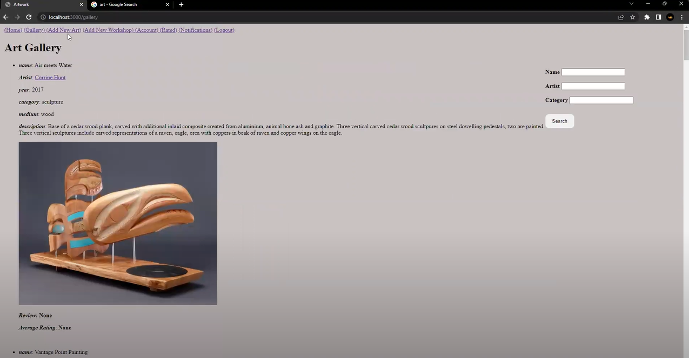
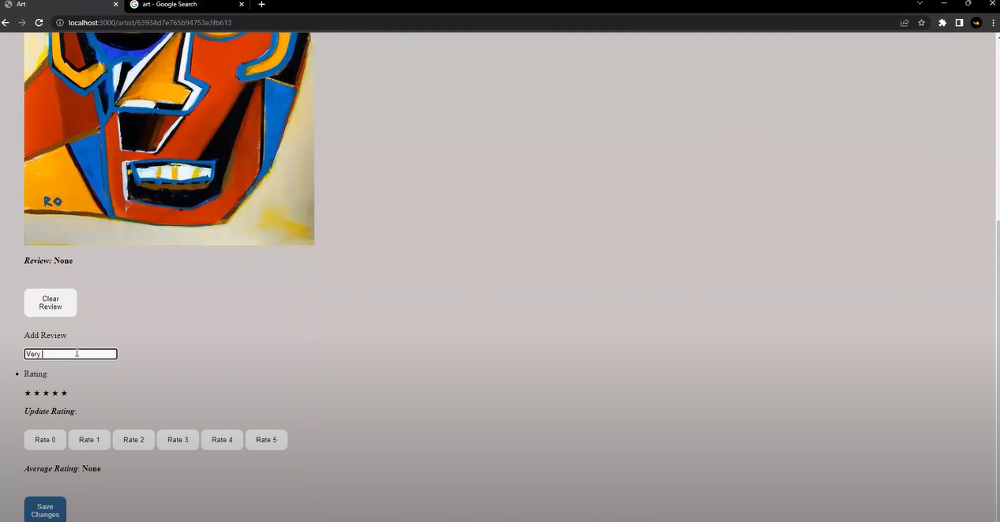

(AUTHOR)
Kunal Barua
Carleton University-COMP2406 (Final Project)

(Some Screenshots)

<ul>
    
<li>Gallery</li>

</ul>

(Youtube Link)
https://youtu.be/6E_Y0p_Zyuo

(Required Modules)
-Please install the following modules before intializing the database and running the server.
npm install express
npm install express-session
npm install pug
npm install mongodb
npm install mongoose
npm install connect-mongodb-session

(DESCRIPTION)
This web application closely follows the assignment specifications and asks user to create an account 
before getting access to the web app which is implemented using sessions module. 

For some extra functionality I have given artist's the permission to delete theeir own 
art which they added to the gallery, only when they are logged in from their artist account.
I have also added a timestamp for every notification the subscriber of an artist gets.
They can also clear the notifications using "Clear" button in notification center. 

(COMPILATION)

After installing the above mentioned modules, initialize the database-initializer.js file
to start the web app from clean slate.

(LAUNCHING THE WEB APP)

After intializing the databse, go to "http://localhost:3000/" to start messing around 
with my website. :)
